# Table of Contents
1. Test Scenarios 
2. Setup Instructions 

# Test Scenarios
1. Positive Test Scenario 1

Given I login with Username as 'vikkram'
and I type password as 'test123'
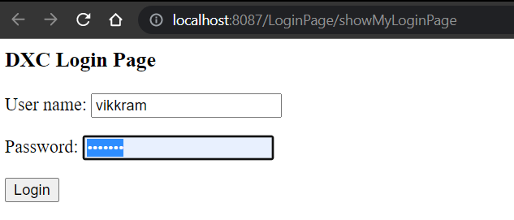
Then I see welcome page 
w/ username as vikkram , 
w/ name as Vikkram McLauren and
role as 'ROLE_EMPLOYEE' 

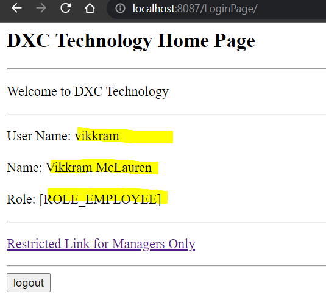
And when user vikkram clicks the restricted link
he  is not able to access as below
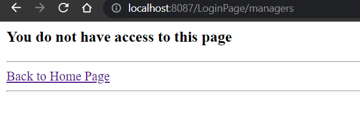

2. Positive Test Scenario 2
Given I login with Username as 'priya'
and I type password as 'test123'
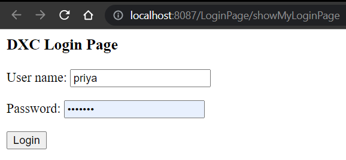

3. Then I see welcome pagew/ username as priya , role as 'ROLE_MANAGER'
and and as 'ROLE_EMPLOYEE'
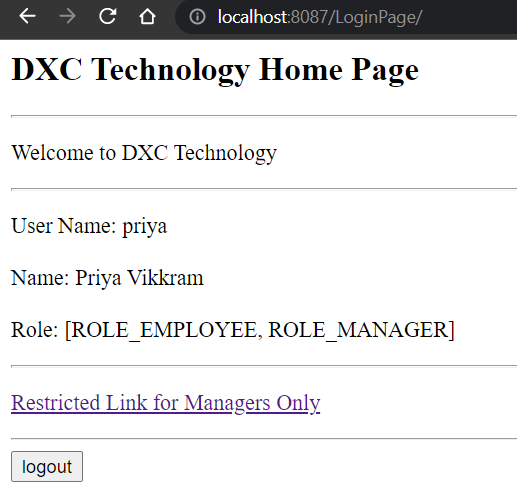
And when user priya clicks the restricted link. 
As a manager, user: priya is able to see the restricted page successfully
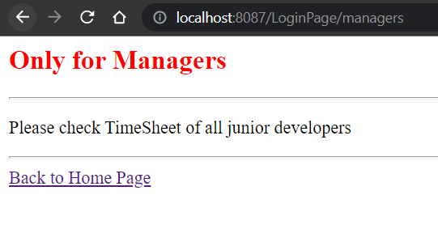

4. Positive Scenario - Admin Role
Given I login with Username as 'manju'
   and I type password as 'test123'
   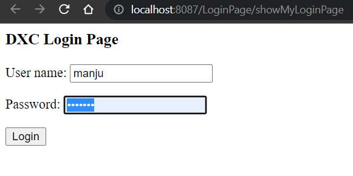
   Then I see welcome page
   w/ username as manju , role as 'ROLE_ADMIN' and as 'ROLE_EMPLOYEE'
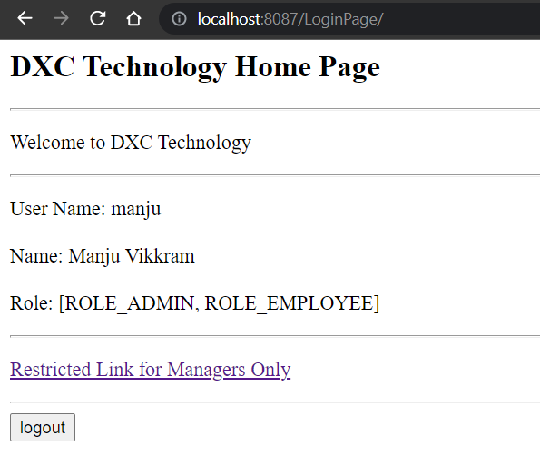
And when user manju clicks the restricted link
   As a Admin, user: manju is unable to see the restricted page successfully
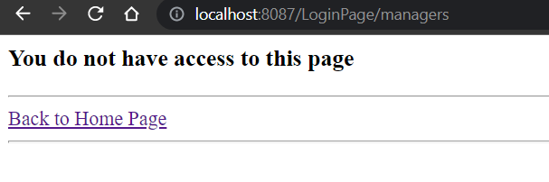

5. When i logout the page successfully logs out
Login as any valid user and press logout 
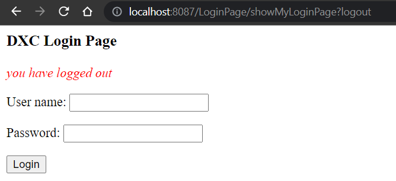

6. Negative scenario - Incorrect username or password
When enter bad username or password that doesn't match the value in database
then "Invalid userid or password" message is displayed
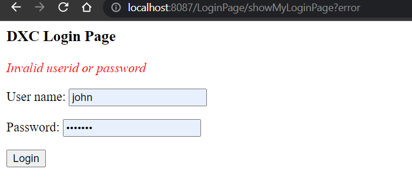

#Setup Instructions

## Pre-requisite
1. MYSQL 8
2. Maven
3. Java 8

Change persistence-mysql.properties

For MySQl Database: change Username & password & port respectively
jdbc.driver=com.mysql.cj.jdbc.Driver
jdbc.url=jdbc:mysql://localhost:3306/DXCEmployee?allowPublicKeyRetrieval=true&useSSL=false
jdbc.user=root
jdbc.password=root