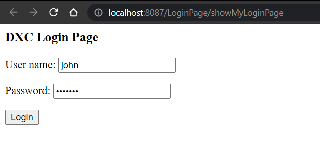
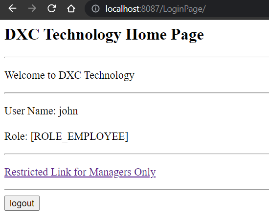
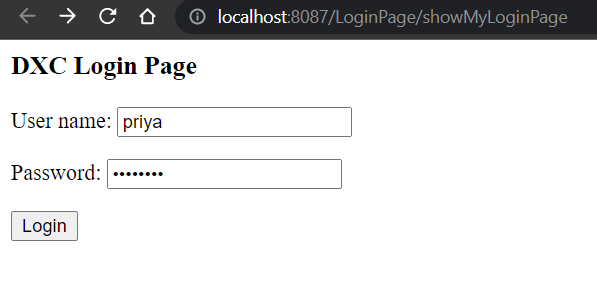
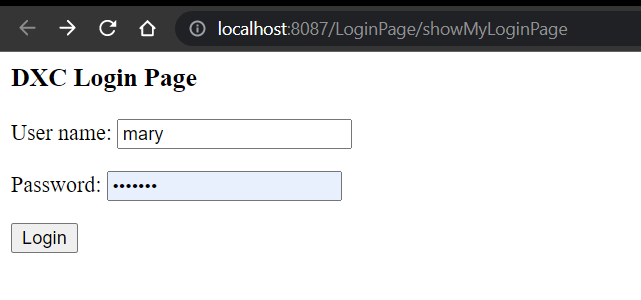
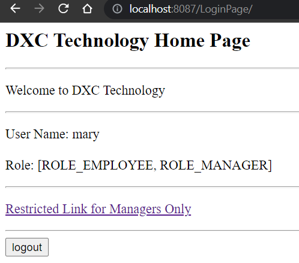
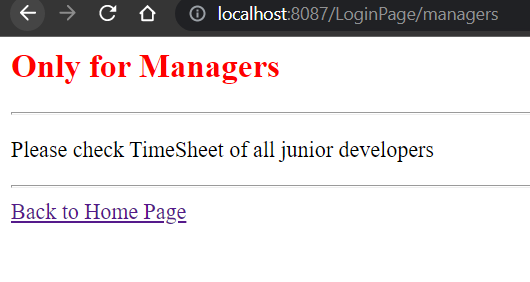

# Table of Contents
1. Test Scenarios 
2. Setup Instructions 

# Test Scenarios
1. Positive Test Scenario 1

Given I login with Username as 'john'
and I type password as 'test123'

Then I see welcome page 
w/ username as john , role as 'Employee' 

And when user john clicks the restricted link
he is not able to access as below

2. Positive Test Scenario 2
Given I login with Username as 'mary'
and I type password as 'test123'

Then I see welcome page
w/ username as john , role as 'Manager'

And when user mary clicks the restricted link
As a manager, user: Mary is able to see the restricted page successfully

3. When i logout the page successfully logs out

4. Negative scenario - Incorrect username or password
When enter bad username or password that doesn't match the value in database
then "Invalid userid or password" message is displayed

#Setup Instructions

## Pre-requisite
1. MYSQL 8
2. Maven
3. Java 8

Change persistence-mysql.properties

For MySQl Database: change Username & password & port respectively
jdbc.driver=com.mysql.cj.jdbc.Driver
jdbc.url=jdbc:mysql://localhost:3306/DXCEmployee?allowPublicKeyRetrieval=true&useSSL=false
jdbc.user=root
jdbc.password=root